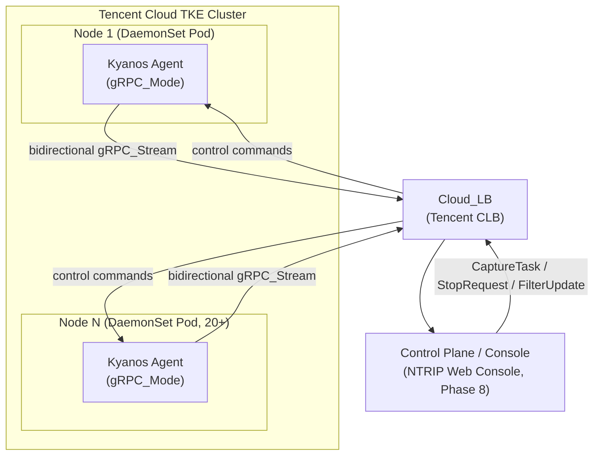
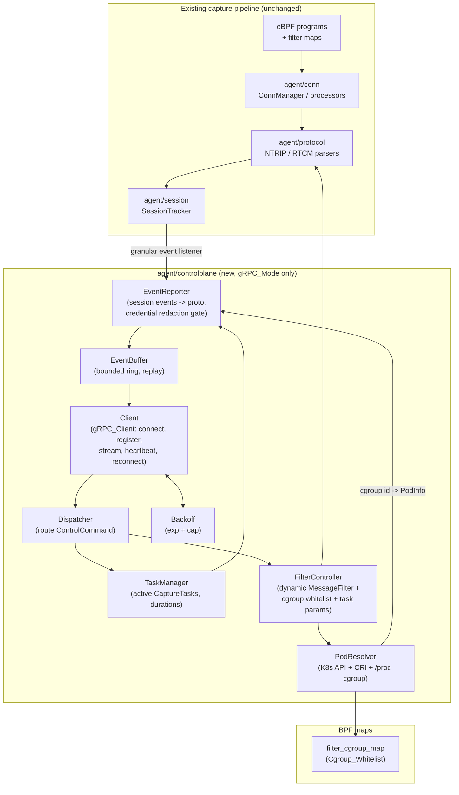

# Design Document

## Overview

Phase 7 turns the standalone Kyanos Agent into a **remotely controllable node Agent** that can register with a central Control Plane (the NTRIP Web Console), receive capture tasks, stream session diagnostic events in real time, resolve kernel events to Kubernetes Pod identities, and survive transient network loss — all **without changing the behavior of the existing standalone CLI tool** when the new mode is not enabled.

The design is governed by two non-negotiable constraints carried over from earlier phases:

1. **Additive, not replacing (叠加不替换).** Every Phase 7 capability is gated behind a new `--grpc-server` flag. When the flag is absent, no gRPC client is constructed, no outbound connection is opened, and the Agent's exit codes, log channels, and TUI are byte-for-byte the Phase 1–6 behavior. This mirrors the existing opt-in pattern used by the session diagnostic engine (`options.SessionDiagnosisEnable`), which the codebase already wires additively in `agent.SetupAgent`.
2. **Credential safety.** The NTRIP password must never leave the Agent in any event, export, or log payload. This extends the Phase 6 precedent where `session.SessionSummaryFromSession` deliberately ignores the `ShowPassword` visibility flag for the structured JSONL feed.

The new functionality lives in a self-contained subsystem (proposed package `agent/controlplane`, fulfilling the `agent/grpc/*` deliverables named in `docs/DEVELOPMENT_PLAN.md` §7.5) plus a shared protobuf contract under `proto/`. The only change to the existing hot path is a small set of additive listener registrations inside `SetupAgent`, all behind the gRPC-mode gate.

### Verification framing

This is a paper/design deliverable. The build-time verification gate is `GOOS=linux` cross-compilation (Requirement 9.3); the existing CI `build_verification.yml` already runs `make build-bpf && make` on Linux runners. Any acceptance criterion that requires a live kernel, a live gRPC peer, or a live K8s cluster is explicitly marked as a **deferred-verification item** in the Testing Strategy and traced to the `docs/ROADMAP_NEXT.md` Linux/TKE backlog. Crucially, the design isolates all such live dependencies behind interfaces so that the pure-logic core (event projection, credential redaction, ring buffer, backoff, set reconciliation, proto round-trip, command routing) compiles and is fully testable on the current environment.

### Scope boundary

The Console itself is **out of scope**; Phase 7 defines only the Agent-side behavior and the shared protobuf contract that both sides will compile against. Deep Cloud Load Balancer client-IP recovery (Proxy Protocol / X-Forwarded-For) is **Phase 10**; Phase 7 only preserves the observed client-address fields on each event so the later phase can recover the real client IP without rework.

## Architecture

### System context



Each node runs one Agent as a DaemonSet Pod. Agents are addressed by **node name** (Requirement 9.1). All Agents connect outbound through the Cloud_LB to the single Console endpoint configured by `--grpc-server`.

### Agent-internal architecture

The Phase 7 subsystem sits beside the existing capture pipeline. The existing pipeline (BPF → `conn` → `protocol` parsers → `session.SessionTracker`) is unchanged; Phase 7 attaches to it through additive hooks.



### Component responsibilities

| Component | Responsibility | Live dependency? |
|-----------|----------------|------------------|
| `Client` (gRPC_Client) | Establish/maintain the connection and bidirectional stream; registration handshake; heartbeat; drive reconnect via `Backoff`. | Yes — live gRPC peer (deferred) |
| `Dispatcher` | Validate and route inbound `ControlCommand`s to the right handler; reject unknown/invalid commands and continue. | No — pure routing |
| `TaskManager` | Track active `CaptureTask`s by `task_id`; arm duration timers; map sessions → owning task. | No — pure state (clock injectable) |
| `FilterController` | Apply `FilterUpdate`s atomically and serially: swap `MessageFilter`, reconcile cgroup whitelist, update task params. | Partial — BPF push deferred |
| `EventReporter` | Subscribe to session diagnostic events; project them into proto `SessionEvent`s; enforce the credential redaction gate; tag with `task_id`. | No — pure projection |
| `EventBuffer` (Local_Event_Buffer) | Bounded ring buffer; retain newest on overflow; count discards; replay in order on reconnect. | No — pure data structure |
| `Backoff` | Compute exponential, capped reconnect delays. | No — pure function |
| `PodResolver` | Resolve K8s Pods → container IDs → cgroup IDs; maintain cgroup→PodInfo cache; push the Cgroup_Whitelist to the BPF map. | Yes — K8s API / CRI / /proc / BPF map (deferred) |
| `CgroupWhitelist` map wrapper | Abstract the BPF map behind an interface so user-space reconciliation logic compiles and tests now; concrete eBPF binding wired after `make build-bpf`. | Yes — live kernel (deferred) |

### Threading and lifecycle model

`SetupAgent` already owns the process lifecycle (signal handling, `ctx`, `stopper`, BPF load goroutine, render loop). Phase 7 adds, **only when `options.GRPCServer != ""`**:

1. Before BPF attach: construct `PodResolver` (if Pod resolution enabled), resolve the initial Cgroup_Whitelist, and push it so the kernel filters from the first event.
2. Build the `Client` and register the `EventReporter` as a granular session listener on the existing `SessionTracker`.
3. Launch the `Client` run loop in a goroutine bound to the existing `ctx`. The loop: dial → register → serve stream (receive commands → `Dispatcher`; drain `EventBuffer` → send) → on error, back off and retry until `ctx` is cancelled.
4. On shutdown (`stopper`/`ctx`), the `Client` closes the stream, flushes what it can, and returns; the existing cleanup (BPF close, JSONL flush) runs unchanged.

Concurrency boundaries: the `Client` send loop and the `EventReporter`/`SessionTracker` callbacks run on different goroutines, decoupled by the `EventBuffer` (the single synchronized hand-off point). `FilterController` serializes updates with a mutex so concurrent `FilterUpdate`s cannot interleave into torn state (Requirement 5.7).

### Real-time event reporting (closing the listener gap)

The existing `session.SessionListener` interface only fires `OnSessionCreated`/`OnSessionClosed` — insufficient for streaming per-event auth/GGA/RTCM/network activity (Requirement 4.1–4.5). The design adds an **additive** richer listener in the `session` package:

```go
// SessionEventListener receives granular, real-time diagnostic events.
// Additive: existing SessionListener is unchanged; the tracker fires both.
type SessionEventListener interface {
    OnAuthEvent(s *NTRIPSession)
    OnGGAEvent(s *NTRIPSession, e GGAEvent)
    OnRTCMEvent(s *NTRIPSession, e RTCMEvent)
    OnNetworkEvent(s *NTRIPSession, kind NetworkEventKind)
    OnSessionClose(s *NTRIPSession)
}
```

The `SessionTracker` fires these from its existing record handlers (`handleNTRIPRequest`, `handleNMEASentence`, `handleRTCMFrame`, the TCP-health handlers, and `OnConnectionClose`). The `session` package keeps zero dependency on gRPC or `controlplane`; the `EventReporter` (in `controlplane`) implements the interface, preserving the existing decoupling discipline (`session` depends only on `protocol/*`).

## Components and Interfaces

### Protobuf service contract (`proto/agent.proto`)

The contract is the single source of truth shared by Agent and Console (Requirement 9.5). It defines exactly the five operations and the message types the requirements name, generated into `proto/agentpb` via `protoc-gen-go` / `protoc-gen-go-grpc` (gRPC and protobuf runtime are already in `go.mod`).

```protobuf
syntax = "proto3";
package kyanos.agent.v1;
option go_package = "kyanos/proto/agentpb";

service AgentService {
    rpc Connect(AgentInfo) returns (stream ControlCommand);   // register + receive commands
    rpc ReportEvents(stream SessionEvent) returns (EventAck);  // stream events to Console
    rpc ReportStatus(AgentStatus) returns (StatusAck);         // managed-pod / health updates
    rpc StartCapture(CaptureTask) returns (TaskResponse);      // explicit task dispatch
    rpc StopCapture(StopRequest) returns (TaskResponse);       // explicit task stop
}
```

The bidirectional `gRPC_Stream` is realized as the `Connect` server stream (commands Console→Agent) paired with the `ReportEvents` client stream (events Agent→Console). `ControlCommand` is a `oneof` so a single command channel carries all command kinds, satisfying Requirement 2.3.

### `controlplane.Client`

```go
type Client struct {
    addr        string            // Console address from --grpc-server
    nodeName    string
    version     string
    transport   TransportConfig   // TLS / insecure config (Req 8.2-8.5)
    buffer      *EventBuffer
    backoff     *Backoff
    dispatcher  *Dispatcher
    hbInterval  time.Duration
    hbTimeout   time.Duration
}

// Run drives connect -> register -> serve -> backoff-retry until ctx is done.
func (c *Client) Run(ctx context.Context) error

// Enqueue hands an already-projected, already-redacted event to the outbound path.
func (c *Client) Enqueue(ev *agentpb.SessionEvent)
```

The `Client` never builds or redacts events itself; it only transports what the `EventReporter` placed in the `EventBuffer`. This keeps the credential-safety gate in exactly one place.

### `controlplane.Dispatcher`

```go
type Dispatcher struct {
    tasks  *TaskManager
    filter *FilterController
}

// Dispatch validates and routes a single inbound command. Unknown or invalid
// commands return an error; the caller logs it and continues with the next
// command (Req 2.7).
func (d *Dispatcher) Dispatch(cmd *agentpb.ControlCommand) error
```

### `controlplane.TaskManager`

```go
type TaskManager struct {
    mu    sync.Mutex
    clock Clock                      // injectable for deterministic duration tests
    tasks map[string]*activeTask     // task_id -> task
}

func (m *TaskManager) Start(task *agentpb.CaptureTask) *agentpb.TaskResponse // Req 3.1-3.5
func (m *TaskManager) Stop(req *agentpb.StopRequest) *agentpb.TaskResponse    // Req 3.6-3.7
func (m *TaskManager) TaskIDForSession(s *session.NTRIPSession) (string, bool) // Req 3.9
func (m *TaskManager) ActiveTaskIDs() []string
```

`activeTask` holds the task's scope (target Pod/namespace/labels), compiled filter, export options, and an optional duration timer that calls `Stop` when it fires (Requirement 3.5).

### `controlplane.FilterController`

```go
type FilterController struct {
    mu        sync.Mutex                  // serializes updates (Req 5.7)
    current   filterState                 // active snapshot
    apply     func(protocol.ProtocolFilter) // swap user-space MessageFilter
    whitelist CgroupWhitelist             // BPF map abstraction
    resolver  *PodResolver
    tasks     *TaskManager
}

// ApplyUpdate validates the whole update first; only on success does it mutate
// any component. On validation failure it returns an error and leaves state
// unchanged (Req 5.5). Partial-failure during application returns an error
// naming the components that changed (Req 5.6).
func (f *FilterController) ApplyUpdate(u *agentpb.FilterUpdate) error
```

`filterState` is an immutable value (compiled `MessageFilter`, desired cgroup set, per-task params). `ApplyUpdate` builds the next state from the current one, validates it, then swaps atomically under `mu` — a validate-then-commit transaction.

### `controlplane.EventReporter`

```go
type EventReporter struct {
    tasks    *TaskManager
    resolver *PodResolver
    redactor *Redactor
    out      func(*agentpb.SessionEvent) // -> EventBuffer
    silent   bool                        // Req 4.10 silent-block configuration
}

// Implements session.SessionEventListener. Each callback projects the session
// state into a proto SessionEvent, tags task_id (Req 3.9) and PodInfo, runs the
// redaction gate (Req 4.8-4.9), and forwards or blocks.
func (r *EventReporter) OnAuthEvent(s *session.NTRIPSession)
func (r *EventReporter) OnGGAEvent(s *session.NTRIPSession, e session.GGAEvent)
func (r *EventReporter) OnRTCMEvent(s *session.NTRIPSession, e session.RTCMEvent)
func (r *EventReporter) OnNetworkEvent(s *session.NTRIPSession, k session.NetworkEventKind)
func (r *EventReporter) OnSessionClose(s *session.NTRIPSession)
```

A single internal projection function `projectEvent(...) (*agentpb.SessionEvent, bool)` is the only path from session state to a wire event. It structurally omits the password (it never reads `NTRIPSession.Password` into any proto field) and then passes the marshaled bytes through the `Redactor` gate before returning.

### `controlplane.Redactor`

```go
type Redactor struct{}

// Confirm returns true if the serialized event provably excludes the session's
// secret(s). If it cannot confirm exclusion, it returns false and the caller
// blocks the event (Req 4.9).
func (r *Redactor) Confirm(ev *agentpb.SessionEvent, secrets []string) bool
```

The gate scans the serialized event for any non-empty known secret value (the session's NTRIP password). Empty secrets are treated as "nothing to leak." This is defense-in-depth on top of structural omission.

### `controlplane.EventBuffer`

```go
type EventBuffer struct {
    mu        sync.Mutex
    ring      []*agentpb.SessionEvent
    cap       int
    discarded uint64
}

func (b *EventBuffer) Push(ev *agentpb.SessionEvent)        // evicts oldest at cap (Req 7.5)
func (b *EventBuffer) DrainInOrder() []*agentpb.SessionEvent // FIFO for replay (Req 7.4)
func (b *EventBuffer) Discarded() uint64
func (b *EventBuffer) Len() int
```

### `controlplane.Backoff`

```go
type Backoff struct {
    Base time.Duration
    Max  time.Duration
    Factor float64 // typically 2.0
}

// Delay returns the delay for attempt n (0-based): min(Base * Factor^n, Max).
func (b Backoff) Delay(attempt int) time.Duration
```

### `controlplane.PodResolver`

```go
type PodResolver struct {
    k8s       PodLister        // K8s API (list pods by ns + labels)  Req 6.1
    runtime   ContainerLister  // CRI/container runtime (container IDs) Req 6.2
    cgroups   CgroupMapper     // /proc cgroup traversal               Req 6.3
    whitelist CgroupWhitelist  // BPF map push                         Req 6.4
    mu        sync.RWMutex
    cache     map[uint64]*PodInfo // cgroup id -> PodInfo
    fallback  bool                // K8s unreachable -> container-id mode (Req 6.8)
}

func (p *PodResolver) ResolveTargets(ctx context.Context) error      // Req 6.1-6.5
func (p *PodResolver) Lookup(cgroupID uint64) (*PodInfo, bool)         // Req 6.6-6.7
```

`PodLister`, `ContainerLister`, `CgroupMapper`, and `CgroupWhitelist` are interfaces, so the resolution and cache logic is unit/property-testable with fakes while the live K8s/CRI/proc/BPF implementations are deferred-verification.

### CLI flag and options wiring

`cmd/root.go` gains a persistent flag, and `cmd/common.go` gains a helper (mirroring `addSessionDiagnosisFlags`/`initSessionDiagnosis`):

```
--grpc-server string         Console address (host:port). Empty => Standalone_CLI_Mode.
--grpc-tls                   Use authenticated, encrypted transport (Req 8.2).
--grpc-tls-insecure          Encrypted but skip transport auth (Req 8.3).
--grpc-ca / --grpc-cert / --grpc-key   Transport credential material (referenced by key name in logs, Req 8.6).
--grpc-pod-resolve           Enable PodResolver (Req 6.9).
--grpc-namespace / --grpc-selector     Target namespace + label selector (Req 6.1).
--grpc-buffer-capacity int   Local_Event_Buffer capacity (Req 7.3).
--grpc-backoff-max duration  Backoff cap (Req 7.2).
--grpc-heartbeat duration / --grpc-heartbeat-timeout duration  (Req 7.6-7.7).
```

`agent/common/options.go` gains a `GRPCServer string` and a `GRPCOptions` struct (default zero value = disabled). `ValidateAndRepairOptions` validates the address when non-empty and rejects startup on an empty/invalid value (Requirement 1.5).

## Data Models

### Protobuf messages (`proto/agent.proto`)

```protobuf
message AgentInfo {                    // registration (Req 2.1, 2.6, 9.1)
    string node_name = 1;              // unique Agent address
    string agent_version = 2;
    repeated PodInfo managed_pods = 3;
}

message PodInfo {                      // Req 6.6
    string pod_name = 1;
    string pod_ip = 2;
    string namespace = 3;
    string node_name = 4;
    repeated string container_ids = 5;
    repeated uint64 cgroup_ids = 6;
}

message ControlCommand {               // Console -> Agent (Req 2.3)
    oneof command {
        CaptureTask  start_capture = 1;
        StopRequest  stop_capture  = 2;
        FilterUpdate update_filter = 3;
    }
}

message CaptureTask {                  // Req 3.1-3.5, 3.8
    string task_id = 1;
    string target_pod = 2;
    string target_namespace = 3;
    map<string, string> pod_labels = 4;
    NTRIPFilterConfig ntrip_filter = 10;
    RTCMFilterConfig  rtcm_filter  = 11;
    int64 duration_seconds = 20;
    ExportOptions export = 21;
}

message StopRequest { string task_id = 1; }                 // Req 3.6-3.7

message FilterUpdate {                 // Req 5.1-5.3
    string task_id = 1;                // empty => global
    repeated string add_pods = 2;
    repeated string remove_pods = 3;
    NTRIPFilterConfig ntrip_filter = 10;
    RTCMFilterConfig  rtcm_filter  = 11;
    int64 duration_seconds = 20;       // optional task-param change
}

message TaskResponse {                 // Req 3.3-3.4, 3.6-3.7
    string task_id = 1;
    bool accepted = 2;
    string reason = 3;                 // populated on reject / not-found
    Status status = 4;                 // ACCEPTED | REJECTED | STOPPED | NOT_FOUND
}

message SessionEvent {                 // Agent -> Console (Req 4.1-4.7, 9.2)
    string task_id = 1;                // owning task (Req 3.9)
    string session_id = 2;             // Req 4.7
    int64  timestamp_ns = 3;           // Req 4.7
    PodInfo pod = 4;                   // resolved identity (may be empty)
    ClientAddr observed_client = 5;    // preserved verbatim (Req 9.2)
    oneof event {
        AuthEvent         auth    = 10;
        GgaEvent          gga     = 11;
        RtcmEvent         rtcm    = 12;
        NetworkEvent      network = 13;
        SessionCloseEvent close   = 14;
    }
}

message AuthEvent {                    // Req 4.2 (NO password field, by construction)
    string method = 1;                 // basic_auth | source_method | none
    bool   success = 2;
    int32  http_status = 3;
    string mountpoint = 4;
    string username = 5;
    int64  login_latency_ms = 6;
}

message GgaEvent {                     // Req 4.3
    double latitude = 1; double longitude = 2;
    int32 fix_quality = 3; int32 num_satellites = 4;
    double hdop = 5; double diff_age = 6; string diff_station_id = 7;
}

message RtcmEvent {                    // Req 4.4
    int32 message_type = 1; int32 size = 2; bool crc_valid = 3; int64 interval_ms = 4;
}

message NetworkEvent {                 // Req 4.5
    int32 retransmissions = 1; double retransmission_rate = 2;
    int64 avg_rtt_us = 3; int64 p95_rtt_us = 4; int64 rtt_jitter_us = 5; int32 tcp_resets = 6;
}

message SessionCloseEvent {            // Req 4.6
    string disconnect_reason = 1;
    string disconnect_detail = 2;
    SessionSummary summary = 3;        // always present, even with no prior events
}

message ClientAddr { string ip = 1; uint32 port = 2; }  // Req 9.2

message AgentStatus { string node_name = 1; repeated PodInfo managed_pods = 2; uint64 discarded_events = 3; }
message EventAck  { uint64 received = 1; }
message StatusAck { bool ok = 1; }
message NTRIPFilterConfig { repeated string mountpoints = 1; repeated string usernames = 2; repeated string versions = 3; bool errors_only = 4; bool gga_only = 5; }
message RTCMFilterConfig  { repeated int32 message_types = 1; bool crc_errors_only = 2; }
message ExportOptions     { bool export_pcap = 1; bool export_parsed = 2; string cos_bucket = 3; }
enum Status { STATUS_UNSPECIFIED = 0; ACCEPTED = 1; REJECTED = 2; STOPPED = 3; NOT_FOUND = 4; }
```

The `NTRIPFilterConfig`/`RTCMFilterConfig` messages map directly onto the existing `ntrip.NTRIPFilter` and the RTCM filter; `FilterController` compiles them back into the existing `protocol.ProtocolFilter` implementations so the runtime filter path is unchanged.

### Go-internal types

```go
// PodInfo mirrors the proto message; PodResolver caches by cgroup id.
type PodInfo struct {
    PodName, PodIP, Namespace, NodeName string
    ContainerIDs []string
    CgroupIDs    []uint64
}

// filterState is an immutable snapshot swapped atomically by FilterController.
type filterState struct {
    messageFilter protocol.ProtocolFilter
    cgroups       map[uint64]struct{}   // desired Cgroup_Whitelist set
    taskParams    map[string]taskParam  // task_id -> params
}

// Clock abstracts time for deterministic duration/backoff/heartbeat tests.
type Clock interface { Now() time.Time; AfterFunc(d time.Duration, f func()) Timer }
```

### Cgroup_Whitelist BPF map

A new map is added to `bpf/pktlatency.bpf.c` and consulted in the filtering path, gated by a control value so it is inert unless gRPC Pod-resolution is active (preserving Standalone_CLI_Mode):

```c
struct {
    __uint(type, BPF_MAP_TYPE_HASH);
    __uint(key_size, sizeof(__u64));   // cgroup id
    __uint(value_size, sizeof(__u8));
    __uint(max_entries, 4096);
} filter_cgroup_map SEC(".maps");
```

The user-space `CgroupWhitelist` interface wraps this map; reconciliation computes the desired set (current ∪ added) \ removed and applies the minimal diff of `Update`/`Delete` operations, following the existing `writeFilterNsIdsToMap` precedent. Because regenerating the Go binding requires `make build-bpf` on Linux, the concrete map-backed implementation is a deferred-verification item; the reconciliation logic that computes the desired set is pure and tested now.

### Data flow: event lifecycle

```mermaid
sequenceDiagram
    participant T as SessionTracker
    participant R as EventReporter
    participant Red as Redactor
    participant B as EventBuffer
    participant C as Client
    participant Con as Console

    T->>R: OnGGAEvent(session, e)
    R->>R: projectEvent (omit password, tag task_id + PodInfo + client addr)
    R->>Red: Confirm(event, [password])
    alt confirmed clean
        Red-->>R: true
        R->>B: Push(event)
        B->>C: (drained by send loop)
        C->>Con: ReportEvents(event)
    else cannot confirm
        Red-->>R: false
        R->>R: block; emit error unless silent
    end
```

When the stream is down, `Push` accumulates into the ring (evicting oldest at capacity); on reconnect, `Client` calls `DrainInOrder` and replays before resuming live sends (Requirements 7.3–7.5).

## Correctness Properties

*A property is a characteristic or behavior that should hold true across all valid executions of a system — essentially, a formal statement about what the system should do. Properties serve as the bridge between human-readable specifications and machine-verifiable correctness guarantees.*

PBT applies well here because the Phase 7 core is a set of **pure functions and in-memory state machines** with clear input/output behavior: mode-gating, address validation, message projection, command routing, task state, filter set algebra, a ring buffer, backoff, and proto serialization. Each has universal properties (invariants, round-trips, idempotence/serializability, metamorphic relations) that hold across a large input space. The live edges (gRPC transport, K8s API, CRI, `/proc`, the BPF map push) are deliberately placed behind interfaces and are tested with integration/example/smoke strategies instead (see Testing Strategy), keeping the properties cheap and deterministic.

The properties below were derived from the prework analysis. Redundant restatements (e.g., the several criteria that all assert "a capability is active iff its flag is set," or "a message carries the state that produced it") were consolidated so each property provides unique validation value.

### Property 1: Mode gating is a total function of the flags

*For any* `AgentOptions`, the gRPC subsystem (Client, Dispatcher, EventReporter, PodResolver) is constructed and active **if and only if** `GRPCServer` is a non-empty valid address; and the PodResolver specifically is active **if and only if** Pod resolution is enabled. When disabled, every Phase 7 component is nil/inactive and no outbound dial is possible.

**Validates: Requirements 1.1, 1.2, 1.3, 1.6, 6.9**

### Property 2: Console address validation

*For any* string supplied as `--grpc-server`, startup validation succeeds if and only if the string is a non-empty syntactically valid Console address; on failure it returns a descriptive error whose text includes the offending value.

**Validates: Requirements 1.5**

### Property 3: Registration and status projection carries Agent state verbatim

*For any* node name, Agent version, and managed-Pod set, the built `AgentInfo` carries exactly those values (node name as the unique identity); and *for any* pair of managed-Pod sets that differ, a status update is produced carrying the new set.

**Validates: Requirements 2.1, 2.4, 2.6**

### Property 4: Command dispatch routes correctly and continues past bad commands

*For any* sequence of inbound `ControlCommand`s, each well-formed command is routed to exactly the handler matching its `oneof` variant, and each unrecognized or schema-invalid command yields a descriptive error without preventing any subsequent well-formed command from being dispatched.

**Validates: Requirements 2.3, 2.7**

### Property 5: Capture task lifecycle

*For any* `CaptureTask`: if it is valid, `Start` tracks it as active with scope and export options equal to the task and returns an accepting `TaskResponse` carrying the task's `task_id`; if it is invalid, it is not tracked and `Start` returns a rejecting response with a non-empty reason. *For any* `StopRequest`: stopping an active task deactivates it and returns a confirming (`STOPPED`) response, while stopping a `task_id` that is not active returns a `NOT_FOUND` response. *For any* task-parameter `FilterUpdate` targeting an active task, only that task's parameters change and other tasks are unaffected.

**Validates: Requirements 3.1, 3.3, 3.4, 3.6, 3.7, 3.8, 5.3**

### Property 6: Duration elapses to auto-stop

*For any* `CaptureTask` with a positive `duration_seconds`, using an injected clock, the task is active before the duration elapses and inactive at or after the duration elapses.

**Validates: Requirements 3.5**

### Property 7: Events are attributed to the producing task

*For any* set of active tasks with disjoint scopes and *any* session matching exactly one task's scope, every `SessionEvent` projected from that session carries the `task_id` of the matching task.

**Validates: Requirements 3.9**

### Property 8: Event projection preserves per-variant attributes

*For any* session and diagnostic event, projection produces a `SessionEvent` whose `oneof` variant matches the event kind (auth, GGA, RTCM, network, close) and carries that kind's attributes equal to the session state; and *for any* session that closes — including one that recorded no prior auth, GGA, RTCM, or network events — projection produces a close variant carrying the disconnect reason and a non-nil session summary.

**Validates: Requirements 4.1, 4.2, 4.3, 4.4, 4.5, 4.6**

### Property 9: Every event carries required envelope fields

*For any* projected `SessionEvent` of any variant, the event has a non-zero timestamp and a non-empty session identifier, and its observed client address fields equal the session's client IP and port unchanged (no Cloud_LB recovery transformation applied).

**Validates: Requirements 4.7, 9.2**

### Property 10: The NTRIP password never leaves the Agent

*For any* session with an arbitrary non-empty NTRIP password — regardless of the diagnostic engine's `ShowPassword`/field-visibility configuration — and *for any* event variant, export line, or subsystem log line produced over or on behalf of the gRPC stream, the serialized output does not contain the password value.

**Validates: Requirements 4.8, 8.1**

### Property 11: Redaction gate soundness

*For any* `SessionEvent` and non-empty secret: if the secret value is injected into any string field of the event, the redaction gate reports "cannot confirm exclusion" and the event is blocked (not forwarded); otherwise the event is forwarded. *For any* block decision, an error is emitted if and only if the event was blocked and the silent-blocking configuration is not set.

**Validates: Requirements 4.9, 4.10**

### Property 12: Filter configuration compiles to a semantically matching filter and swaps atomically

*For any* NTRIP/RTCM filter configuration and *any* parsed record, the compiled `MessageFilter` accepts the record if and only if the record satisfies the configured criteria; and after a successful `FilterUpdate`, the active filter is the newly compiled one, so records evaluated after the swap use the new criteria.

**Validates: Requirements 3.2, 5.2, 5.4**

### Property 13: Failed-validation FilterUpdate is transactional

*For any* `FilterUpdate` that fails validation, applying it leaves the active filter state (message filter, desired cgroup set, task parameters) identical to the pre-update state and returns a descriptive error.

**Validates: Requirements 5.5**

### Property 14: Concurrent FilterUpdates serialize to a consistent state

*For any* set of `FilterUpdate`s applied concurrently, the final active filter state is internally consistent (never torn) and equals the result of applying those updates in some sequential order.

**Validates: Requirements 5.7**

### Property 15: Cgroup whitelist set reconciliation

*For any* current cgroup whitelist set and *any* add/remove instruction, the reconciled desired set equals `(current ∪ add) \ remove`, and the diff of map `Update`/`Delete` operations applied equals the difference between the desired and current sets.

**Validates: Requirements 5.1, 6.4**

### Property 16: cgroup-to-PodInfo cache round-trip

*For any* mapping of cgroup identifiers to `PodInfo` loaded into the resolver cache, looking up a present cgroup identifier returns its exact `PodInfo` (Pod name, Pod IP, namespace, node name), and looking up an absent cgroup identifier reports unresolved without terminating processing.

**Validates: Requirements 6.6, 6.7**

### Property 17: Backoff is monotonic, geometric, and capped

*For any* attempt number n ≥ 0, the backoff delay equals `min(Base × Factor^n, Max)`; consequently the delay is non-decreasing in n and never exceeds the configured maximum.

**Validates: Requirements 7.1, 7.2**

### Property 18: Local event buffer retains newest in order and counts discards

*For any* sequence of pushed events of length L into a buffer of capacity C ≥ 1, draining returns exactly the last `min(L, C)` events in their original push order, and the discarded counter equals `max(0, L − C)` — independent of connection state.

**Validates: Requirements 7.3, 7.4, 7.5**

### Property 19: Transport mode selection

*For any* Console connection configuration: when transport credentials are present and authentication is required, transport construction selects an authenticated encrypted transport; when credentials are present but authentication is disabled, it selects an encrypted transport without authentication; when credentials are required by configuration but missing, it returns an error and refuses to construct the transport.

**Validates: Requirements 8.2, 8.3, 8.4**

### Property 20: Transport credentials are excluded from logs

*For any* transport credential values loaded for the Console connection, the subsystem's credential-loading log output references the credentials by configuration key name only and never contains the credential values.

**Validates: Requirements 8.6**

### Property 21: Protobuf message round-trip

*For any* instance of each contract message type (`AgentInfo`, `ControlCommand`, `CaptureTask`, `StopRequest`, `FilterUpdate`, `SessionEvent`, `TaskResponse`, `AgentStatus`, and their nested types), unmarshaling the marshaled bytes produces an equal message.

**Validates: Requirements 9.5**

## Error Handling

The subsystem follows the existing Kyanos convention: explicit handling with the dedicated loggers (`common.AgentLog`), no `panic` on recoverable conditions, and resilience over termination. Errors are classified by required response:

| Condition | Requirement | Handling |
|-----------|-------------|----------|
| Empty/invalid `--grpc-server` | 1.5 | Reject startup before any subsystem is built; error names the offending value. |
| Registration rejected by Console | 2.5 | Log the rejection reason; retry registration under the `Backoff` policy. |
| Unknown / schema-invalid control command | 2.7 | Return a descriptive error from `Dispatch`; log it; continue with the next command. The receive loop never aborts on a single bad command. |
| `CaptureTask` rejected | 3.4 | Return `TaskResponse{accepted=false, reason=...}`; do not track the task. |
| `StopRequest` for unknown task | 3.7 | Return `TaskResponse{status=NOT_FOUND}`; no state change. |
| Cannot confirm password exclusion | 4.9, 4.10 | Block the event; emit a descriptive error unless silent-blocking is configured. Fail closed — when in doubt, do not send. |
| `FilterUpdate` fails validation | 5.5 | Reject atomically; retain previous filter state unchanged; emit descriptive error (validate-then-commit). |
| `FilterUpdate` partial failure (e.g., BPF push fails after user-space swap) | 5.6 | Emit a descriptive error naming the components that changed; already-applied components remain in effect for subsequent records. |
| BPF map push fails after successful resolution | 6.5 | Emit a descriptive error; retain the resolved cache and continue (do not terminate). |
| Kernel event cgroup id absent from cache | 6.7 | Report unresolved; continue processing. |
| K8s API unreachable at startup | 6.8 | Emit a descriptive error; fall back to existing container-id based filtering for the process lifetime; do not terminate. |
| Stream lost / heartbeat ack timeout | 7.1, 7.7 | Treat the stream as lost; buffer events locally; reconnect under `Backoff`. |
| Buffer at capacity | 7.5 | Discard oldest; increment discard counter; report the count (also surfaced in `AgentStatus`). |
| Required transport credentials missing/invalid | 8.4, 8.5 | Refuse to establish the stream; emit a descriptive error. |

Two cross-cutting rules: **(a) fail closed for credentials** — any uncertainty about password exclusion blocks the event rather than risking a leak; **(b) degrade, don't die** — resolution, push, and connectivity failures degrade to a reduced mode (fallback filtering, local buffering, reconnect) so an Agent never becomes a dead Pod from a transient fault.

## Testing Strategy

### Dual approach

- **Property-based tests** verify the 21 universal properties above across generated inputs. They target the pure-logic core, which is fully exercisable on the current (non-Linux, no-eBPF) environment.
- **Unit / example tests** cover specific scenarios and behaviors that are not universal: the no-flag compatibility example (1.4), the heartbeat interval/timeout timers with a fake clock (7.6, 7.7).
- **Edge-case tests** cover failure-injection behaviors: partial `FilterUpdate` failure (5.6), BPF-push failure after resolution (6.5), K8s-unreachable fallback (6.8).
- **Integration tests** (with in-process fakes now; live peers deferred) cover transport and external-service wiring: stream establishment (2.2), PodResolver against fake K8s/CRI/cgroup listers (6.1, 6.2, 6.3, 6.4), bad-credential stream refusal (8.5), and unauthenticated-peer rejection (8.7).
- **Smoke tests** cover one-time setup and deployment facts: `GOOS=linux` build gate (9.3), DaemonSet/node-name addressing (9.1), and the deferred-verification documentation (9.4).

### Property-based testing library

Go is the target language and no PBT library is currently used in the repo. The design selects **`pgregory.net/rapid`** (idiomatic Go generators, integrates with the standard `testing` package, good shrinking). `testing/quick` is the zero-dependency fallback if adding a dependency is undesirable. Property tests must **not** be implemented from scratch — they use the chosen library's generators and runner.

Requirements:
- Each property test runs a **minimum of 100 iterations** (the library default checks ≥100; configure explicitly).
- Each property test is tagged with a comment referencing its design property, in the format:
  `// Feature: agent-grpc-control-plane, Property {number}: {property_text}`
- Each of the 21 properties is implemented by a **single** property-based test.

### Mapping properties to test targets

| Property | Primary unit under test | Generators |
|----------|------------------------|------------|
| P1 mode gating | `gRPCModeEnabled` / subsystem constructor | random `AgentOptions` (flag combinations) |
| P2 address validation | `validateGRPCServer` | valid + invalid address strings (empty, no port, bad port, spaces) |
| P3 registration projection | `buildAgentInfo` / `buildStatus` | node/version strings, pod sets |
| P4 dispatch | `Dispatcher.Dispatch` | command streams across all oneof variants + malformed |
| P5 task lifecycle | `TaskManager` | valid/invalid `CaptureTask`, `StopRequest`, param updates |
| P6 duration | `TaskManager` + fake `Clock` | positive durations |
| P7 attribution | `TaskManager.TaskIDForSession` + projection | disjoint-scope tasks + sessions |
| P8 projection | `projectEvent` | sessions with each event kind incl. empty sessions |
| P9 envelope | `projectEvent` | any session/event + client addrs |
| P10 credential exclusion | `projectEvent` + sinks + `Redactor` | sessions with random non-empty passwords, `ShowPassword` toggled, password echoed into adjacent fields |
| P11 gate | `Redactor.Confirm` + reporter block path | events + secret injection into arbitrary fields; silent flag |
| P12 filter compile | `compileFilter` + `FilterController` swap | filter configs + records |
| P13 transactional reject | `FilterController.ApplyUpdate` | invalid updates + arbitrary starting states |
| P14 serializability | `FilterController.ApplyUpdate` (concurrent) | N random updates run on goroutines (run with `-race`) |
| P15 set reconciliation | whitelist reconcile function | current sets + add/remove ops |
| P16 cache round-trip | `PodResolver.Lookup` | cgroup→PodInfo maps, present/absent ids |
| P17 backoff | `Backoff.Delay` | attempt numbers, base/factor/max configs |
| P18 ring buffer | `EventBuffer` | push sequences + capacities |
| P19 transport selection | `buildTransport` | credential config space |
| P20 creds in logs | credential loader | random credential values (captured log sink) |
| P21 proto round-trip | generated `agentpb` types | random message instances |

### Deferred-verification items (Requirement 9.4)

These require a live kernel, a live gRPC peer, or a live K8s cluster and cannot run on the current environment. They are tracked against the Linux/TKE backlog in `docs/ROADMAP_NEXT.md` (§8 ⚠️LINUX items):

1. **Live bidirectional stream establishment** (2.2) — verified against a real Console or an in-process gRPC server on Linux.
2. **eBPF `filter_cgroup_map` push and kernel-side filtering** (6.4, and the regeneration of Go bindings via `make build-bpf`) — verified on a live kernel; until then the user-space reconciliation logic (P15) stands in.
3. **PodResolver against a live K8s API / CRI / `/proc`** (6.1, 6.2, 6.3) — verified on TKE; fakes cover the composition logic now.
4. **TLS handshake and unauthenticated-peer rejection** (8.5, 8.7) — verified against a real TLS endpoint; option-selection logic (P19) is tested now.
5. **20+ node DaemonSet rollout** (9.1) — operational validation on TKE.

The build-time gate (9.3) — `GOOS=linux` cross-compilation via the existing `build_verification.yml` (`make build-bpf && make`) — is the contractual proof obligation for this paper deliverable, and the entire pure-logic core plus its property tests must pass `GOOS=linux go test` for the `controlplane`, `session`, and `proto/agentpb` packages.
